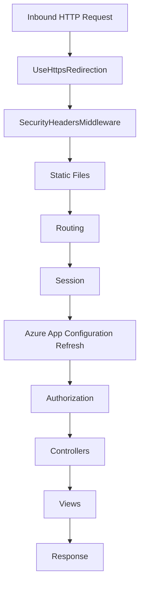

# 🏗 Architecture Overview

## High-Level

MVCApp1 is an ASP.NET Core MVC application targeting **.NET 9**. It uses the MVC pattern with additional architectural components:

- **Controllers**: Handle HTTP requests and orchestrate responses
- **Views**: Razor templates for HTML rendering
- **Models**: View models and domain models
- **Services**: Business logic and external integrations (dependency-injected)
- **Middleware**: Custom middleware for security headers and cross-cutting concerns
- **Telemetry**: Application Insights integration with custom telemetry initializers
- **Features**: Feature flags for controlled rollouts using Azure App Configuration
- **Program.cs**: Bootstraps the web host and configures middleware

## Request Pipeline



> Note: Azure App Configuration middleware refreshes feature flags and configuration values per-request when configured.

## Folder Layout

```text
Controllers/         MVC controllers
Models/              View/Domain models
Views/               Razor views
Services/            Business logic services (ISearchService, IWeatherService, etc.)
Middleware/          Custom middleware (SecurityHeadersMiddleware)
Telemetry/           Application Insights telemetry initializers
Features/            Feature flag constants
wwwroot/             Static assets (css, js, images, lib/)
Properties/          launchSettings.json
appsettings*.json    Configuration files
tests/               Test projects (Playwright, Unit tests)
```

## Dependencies

### Core Frameworks
- **Microsoft.NET.Sdk.Web** (ASP.NET Core MVC for .NET 9)
- **Logging** via `ILogger<T>` (configured by default)

### Application Insights & Telemetry
- **Microsoft.ApplicationInsights.AspNetCore** - Core Application Insights SDK
- **Microsoft.ApplicationInsights.WindowsServer.TelemetryChannel** - Enhanced telemetry channel

### Feature Management
- **Microsoft.FeatureManagement.AspNetCore** - Feature flag management
- **Microsoft.Azure.AppConfiguration.AspNetCore** - Azure App Configuration integration

### Caching
- **Microsoft.Extensions.Caching.StackExchangeRedis** - Redis distributed cache support (optional, falls back to in-memory)

## Extensibility Points

- **Services** in `Program.cs`: `builder.Services.AddControllersWithViews()`
- **Middleware**: Add via `app.Use...` in `Program.cs`
- **Dependency Injection**: Register services in `Program.cs` `builder.Services`

## Services Layer

The application uses dependency injection to provide services to controllers:

### ISearchService
Provides search functionality with proper abstraction over data access. The in-memory implementation (`InMemorySearchService`) serves as a demo; production would use Entity Framework or Dapper.

**Methods:**
- `SearchAsync(SearchQuery query)` - Searches for results matching query criteria
- `GetRecentQueries(int count)` - Returns recent query history for audit purposes
- `TotalQueryCount` - Gets total number of queries executed

### IWeatherService
Mock weather service for demonstration purposes. Shows proper async patterns and DI.

**Methods:**
- `GetWeatherAsync(string city)` - Fetches weather data for a city
- `GetStats()` - Returns service statistics (API call count, health status)

### IUserProfileService
Manages user profile data with proper encapsulation. In-memory implementation for demo purposes.

**Methods:**
- `GetProfileAsync(string userId)` - Retrieves user profile
- `UpdateFieldAsync(string userId, string field, string value)` - Updates a profile field
- `GetStats()` - Returns service statistics

### IStyleGeneratorService
Generates random styles for CSS demonstration pages.

**Methods:**
- `GetRandomFont()` - Returns a random font family
- `GetRandomColor()` - Returns a random color
- `GenerateChaosStyle()` - Generates chaotic inline styles for demo

All services are registered as singletons in `Program.cs` and injected via constructor injection.

## Middleware

### SecurityHeadersMiddleware
Custom middleware that adds security headers to all HTTP responses:
- **X-Content-Type-Options**: `nosniff` - Prevents MIME type sniffing
- **X-Frame-Options**: `DENY` - Prevents clickjacking
- **X-XSS-Protection**: `1; mode=block` - Enables browser XSS filtering
- **Referrer-Policy**: `strict-origin-when-cross-origin`
- **Content-Security-Policy**: Restricts resource loading to trusted sources

Registered via `app.UseSecurityHeaders()` extension method.

## Telemetry

### CustomTelemetryInitializer
Implements `ITelemetryInitializer` to add custom properties to all telemetry items sent to Application Insights.

**Properties Added:**
- `ApplicationName` - Set to "MVCApp1" for identifying telemetry source

Registered in `Program.cs` as a singleton telemetry initializer.

## Feature Flags

The application uses Microsoft Feature Management with Azure App Configuration for feature toggles:

### Available Feature Flags (defined in Features/FeatureFlags.cs)
- **Feature1** - Example feature flag
- **DarkMode** - Dark mode toggle
- **ContactForm** - Contact form feature
- **BetaFeatures** - Master toggle for beta features

Features are gated using the `[FeatureGate]` attribute on controller actions. Configuration can be:
- Local: `appsettings.json` under `FeatureManagement` section
- Remote: Azure App Configuration (automatically refreshed every 30 seconds)

### Azure App Configuration
When configured, the app connects to Azure App Configuration using:
- Managed Identity (`DefaultAzureCredential`) when endpoint is provided
- Connection string when explicitly configured
- Falls back to local configuration if unavailable

Feature flags refresh automatically every 30 seconds when a sentinel value changes.

## CI/CD & Quality

- **GitHub Actions**: `.github/workflows/dotnet.yml` for build/test
- **Copilot Agents**: `.github/workflows/copilot-agents.yml` for code review, security, documentation checks
- **Documentation Helper**: Ensures new `public` APIs include XML docs
- **Playwright Tests**: End-to-end smoke tests in `tests/MVCApp1.PlaywrightTests`
- **Unit Tests**: Controller and service tests in `tests/MVCApp1.UnitTests`
- **Coverage Targets**: Controllers require ≥90% code coverage

## Configuration Management

### 12-Factor App Principles
The application follows 12-factor app principles:
- **Configuration**: Externalized via environment variables and `appsettings.json`
- **Dependencies**: Explicitly declared in `.csproj`
- **Backing Services**: Redis cache (optional), Azure App Configuration
- **Stateless Processes**: Session state optional (in-memory or Redis)

### Environment-Specific Configuration
- Development: Uses in-memory cache, local feature flags
- Production: Can use Redis cache, Azure App Configuration, Application Insights

## Models

The application includes several model types:

### View Models
- **ErrorViewModel** - Error page display model
- **SearchQuery** - Search parameters
- **SearchResult** - Search result item
- **WeatherData** - Weather information
- **GodObjectProfile** - User profile data (anti-pattern demo)
- **ViewLogicData** - Calculator demo data (anti-pattern demo)
- **InlineCssModel** - CSS demo model (anti-pattern demo)

### Model Validation
Models use data annotations for validation (`[Required]`, `[StringLength]`, etc.)
